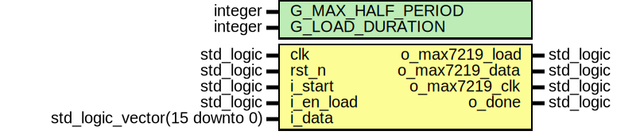

# Entity: max7219_if
## Diagram

## Description
## Generics and ports
### Table 1.1 Generics
| Generic name      | Type    | Value | Description |
| ----------------- | ------- | ----- | ----------- |
| G_MAX_HALF_PERIOD | integer | 4     |             |
| G_LOAD_DURATION   | integer | 4     |             |
### Table 1.2 Ports
| Port name      | Direction | Type                          | Description |
| -------------- | --------- | ----------------------------- | ----------- |
| clk            | in        | std_logic                     |             |
| rst_n          | in        | std_logic                     |             |
| i_start        | in        | std_logic                     |             |
| i_en_load      | in        | std_logic                     |             |
| i_data         | in        | std_logic_vector(15 downto 0) |             |
| o_max7219_load | out       | std_logic                     |             |
| o_max7219_data | out       | std_logic                     |             |
| o_max7219_clk  | out       | std_logic                     |             |
| o_done         | out       | std_logic                     |             |
## Signals, constants and types
### Signals
| Name                 | Type                                           | Description |
| -------------------- | ---------------------------------------------- | ----------- |
| s_data               | std_logic_vector(15 downto 0)                  |             |
| s_en_load            | std_logic                                      |             |
| s_start              | std_logic                                      |             |
| s_init_data          | std_logic                                      |             |
| s_en_clk             | std_logic                                      |             |
| s_max7219_data       | std_logic                                      |             |
| s_max7219_clk        | std_logic                                      |             |
| s_max7219_clk_p      | std_logic                                      |             |
| s_max7219_clk_f_edge | std_logic                                      |             |
| s_max7219_clk_r_edge | std_logic                                      |             |
| s_max7219_load       | std_logic                                      |             |
| s_start_r_edge       | std_logic                                      |             |
| s_done               | std_logic                                      |             |
| s_cnt_15             | integer range 0 to 15                          |             |
| s_cnt_16             | integer range 0 to 16                          |             |
| s_cnt_half_period    | integer range 0 to G_MAX_HALF_PERIOD - 1       |             |
| s_load_px            | std_logic_vector(G_LOAD_DURATION - 1 downto 0) |             |
| s_end_frame          | std_logic                                      |             |
## Processes
- **p_latch_inputs**: ***( clk, rst_n )***

- **p_en_clk**: ***( clk, rst_n )***

- **p_data_mngt**: ***( clk, rst_n )***

- **p_done_mngt**: ***( clk, rst_n )***

- **p_clk_mngt**: ***( clk, rst_n )***

- **p_clk_f_edge_mngt**: ***( clk, rst_n )***

- **p_pipe_load**: ***( clk, rst_n )***

